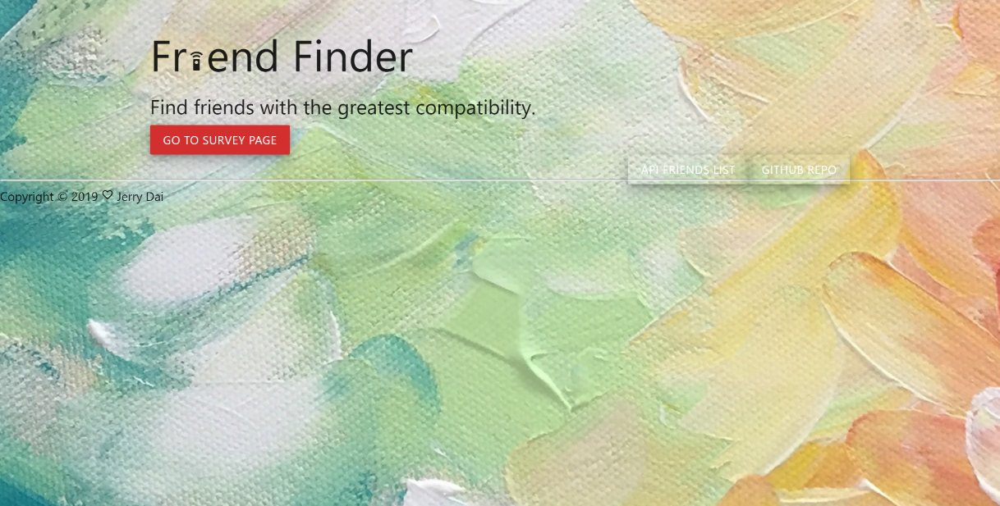
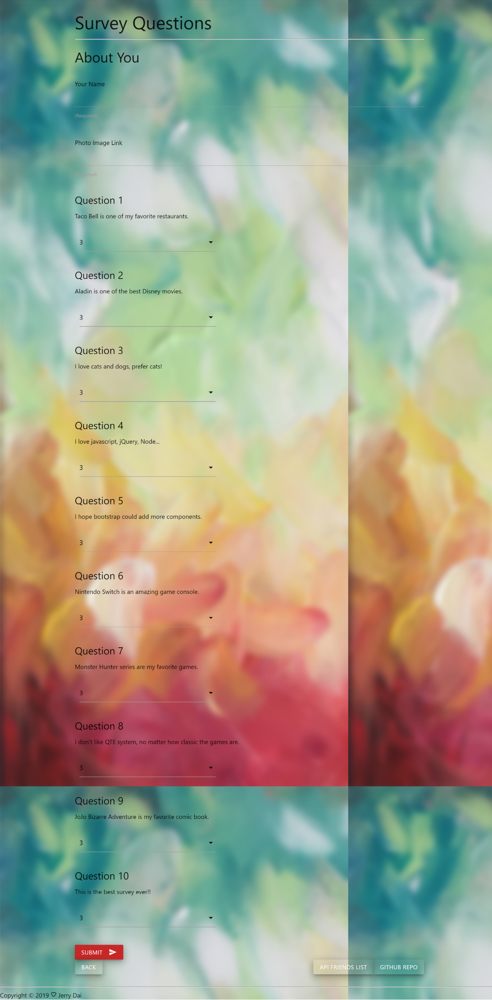
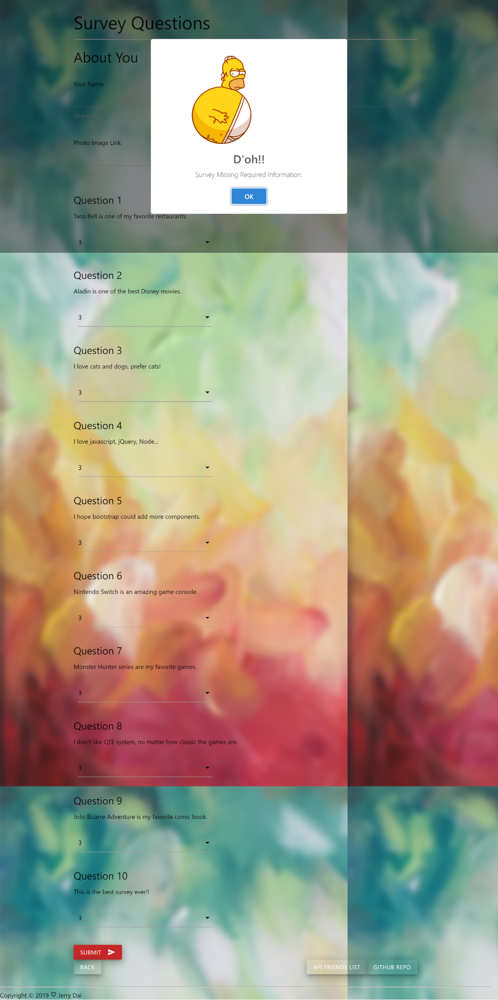
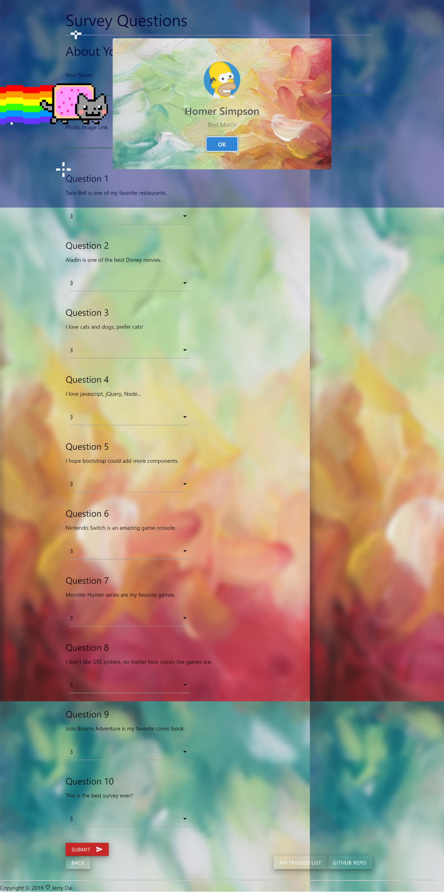

# friend-finder1
# Instructions
Friend Finder survey has 10 questions. Each answer will be on a scale of 1 to 5 based on how much the user agrees or disagrees with a question. concert
--------------

# Friend Finder App built with Node.js and Express.js

# Determine your most compatible friend using the following as a guide:

How it works?
------------

concert

# Convert your survey results into a simple array of numbers (ex: [5, 1, 4, 4, 5, 1, 2, 5, 4, 1]).
With that done, compare the difference between your scores against those from other users, question by question. Add up the differences to calculate the totalDifference.
Example:
Your secores: [5, 1, 4, 4, 5, 1, 2, 5, 4, 1]
Another User: [3, 2, 6, 4, 5, 1, 2, 5, 4, 1]
Total Difference: 2 + 1 + 2 = 5
The closest match will be the user with the least amount of difference.
Once you've found the most compatible friend, the App will display the result as a modal pop-up.

The modal displays both the name and picture of the closest match.
concert
---------

concert
--------

This App is also availble to check the API Friends list
